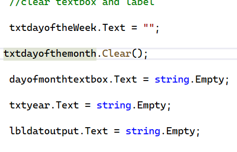
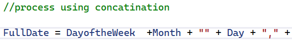

# DISCOUS.....
1. Clear TextBox and Label

The application can clear the entered date information and the output label.

These statements remove the current values from the controls.

2. Process Using String Concatenation

The application combines separate date values into a complete date using the + operator.

String concatenation means joining different pieces of text together.

3. Creating Variables

The application creates variables to store the information entered by the user. Each variable stores a specific value, such as the day of the week, month, day, and year.

