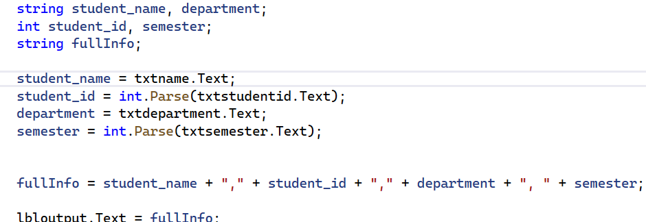
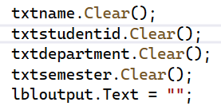

# DISCOUSE CHAPTER 1
# Introduction to Visual C#

## Objects

An object is a program component that contains data and performs operations.

* **Properties** – data stored in an object.
* **Methods** – operations an object can perform.

## Controls

Controls are objects that are visible in a program GUI.

Examples:

* Label
* Button
* TextBox
* PictureBox

## Visual Studio

Visual Studio is an Integrated Development Environment (IDE).

Important parts include:

* Designer Window
* Solution Explorer
* Properties Window
* Toolbox

## Projects and Solutions

A **project** is an application that contains several files.

A **solution** is a container that can hold one or more projects.

## Forms and Controls

A Windows Forms application starts with a form. Controls can be added to the form from the Toolbox.

Controls can be:

* Moved
* Resized
* Deleted
* Changed using the Properties Window

## Properties

Properties control how an object looks and behaves.

Examples:

* `Text`
* `Name`
* `Font`
* `Size`
* `AutoSize`
* `Visible`

## Naming Controls

Control names are identifiers.

Rules:

* The first character must be a letter or `_`.
* Other characters can be letters, numbers, or `_`.
* Spaces are not allowed.

Example:

```csharp
showDayButton
```

## C# Code

C# code is organized into:

**Namespace → Class → Method**

A namespace contains classes, a class contains methods, and a method contains programming statements.

## Event-Driven Programming

Windows Forms applications are event-driven.

An event can happen when the user:

* Clicks a button
* Presses a key
* Moves the mouse

An **event handler** is a method that runs when a specific event happens.

## MessageBox

`MessageBox.Show()` is used to display a message.

```csharp
MessageBox.Show("Hello World");
```

## Label Control

A Label control displays text on a form.

Important properties include:

* `Text`
* `Name`
* `Font`
* `BorderStyle`
* `AutoSize`
* `TextAlign`

## IntelliSense

IntelliSense provides automatic code completion while writing C# code.

It can suggest:

* Keywords
* Variables
* Methods
* Classes
* Properties

## PictureBox Control

A PictureBox control displays an image on a form.

Important properties:

* `Image`
* `SizeMode`
* `Visible`

## Comments

Comments are used to explain parts of the code.

Single-line comment:

```csharp
// This is a comment
```

Block comment:

```csharp
/*
   This is a block comment
*/
```

## Closing a Form

To close the current form:

```csharp
this.Close();
```

To close the whole application:

```csharp
Application.Exit();
```

## Syntax Errors

A syntax error occurs when the code does not follow the correct C# syntax.

Visual Studio shows syntax errors with a red jagged underline.


1.Creating Variables student_name → stores the student name. student_id → stores the student ID. department → stores the department. semester → stores the semester. fullInfo → stores the combined information.


Getting and Processing Information txtname.Text → gets the student name. txtstudentid.Text → gets the student ID. txtdepartment.Text → gets the department. txtsemester.Text → gets the semester. int.Parse() → converts text into an integer. fullInfo → combines all the student information.


Displaying and Clearing the Result lbloutput.Text = fullInfo → displays the result. .Clear() → clears the information from the TextBoxes.

